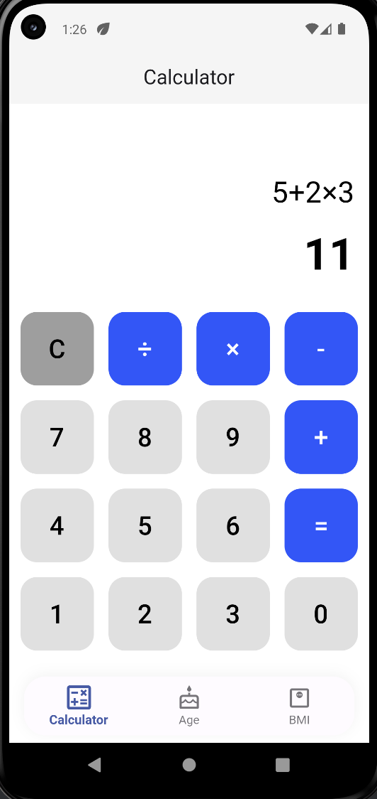
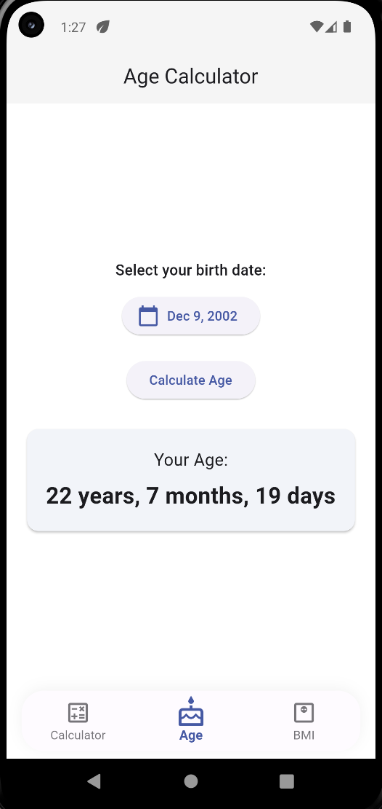
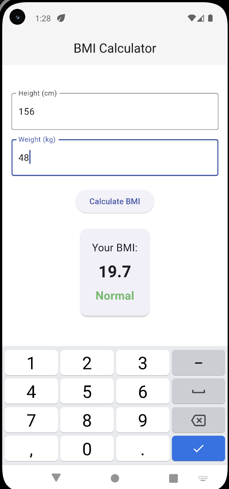

# Calculator App

A modern Flutter application that combines multiple useful tools in one elegant interface. Built with Material Design 3 and featuring smooth animations, this app provides three essential utilities: Calculator, Age Calculator, and BMI Calculator.

## Features

### Modern UI/UX
- **Material Design 3** implementation with professional styling
- **Animated bottom navigation** with bubble effect and smooth transitions
- **Responsive design** that adapts to different screen sizes
- **Professional color scheme** with minimal, clean aesthetics
- **Smooth animations** and micro-interactions throughout the app

### (i) Calculator
- **Full-featured calculator** with basic arithmetic operations
- **Real-time calculation** using math expressions parser
- **Error handling** for invalid expressions
- **Clean, intuitive interface** with proper button layout
- **Support for**: Addition (+), Subtraction (-), Multiplication (×), Division (÷)

### (ii) Age Calculator
- **Date picker integration** for easy birth date selection
- **Precise age calculation** in years, months, and days
- **Date validation** with reasonable range limits (1900 to present)
- **Formatted date display** using internationalization
- **Animated result cards** with smooth scaling effects

### (iii) BMI Calculator
- **Height and weight input** with proper validation
- **Instant BMI calculation** with category classification
- **Color-coded results** for different BMI categories:
  - 🟡 Underweight (< 18.5)
  - 🟢 Normal (18.5 - 24.9)
  - 🟠 Overweight (25.0 - 29.9)
  - 🔴 Obese (≥ 30.0)
- **Error handling** for invalid inputs
- **Professional result display** with category indicators

## Installation

1. **Clone the repository**
   ```bash
   git clone https://github.com/bhartisahu09/Calculator
   cd multi_utility_app
   ```

2. **Install dependencies**
   ```bash
   flutter pub get
   ```

3. **Run the app**
   ```bash
   flutter run
   ```

## Screenshots

| Calculator | Age Calculator | BMI Calculator |
|:---:|:---:|:---:|
| |  |  |

## Project Structure

```
multi_utility_app/
├── lib/
│   ├── main.dart                 # Main app entry point and navigation
│   ├── calculator_widget.dart    # Calculator functionality
│   ├── age_calculator_widget.dart # Age calculator with date picker
│   └── bmi_calculator_widget.dart # BMI calculator with validation
├── android/                      # Android-specific configurations
├── ios/                         # iOS-specific configurations
├── pubspec.yaml                 # Dependencies and project configuration
└── README.md                    # This file
```

## Usage

### Calculator
1. Tap the calculator icon in the bottom navigation
2. Use the number pad to input your calculation
3. Press the operation buttons (+, -, ×, ÷) as needed
4. Press '=' to see the result
5. Press 'C' to clear and start over

### Age Calculator
1. Navigate to the Age Calculator tab
2. Tap "Pick Date" to select your birth date
3. Press "Calculate Age" to see your exact age
4. View the result showing years, months, and days

### BMI Calculator
1. Go to the BMI Calculator tab
2. Enter your height in centimeters
3. Enter your weight in kilograms
4. Press "Calculate BMI" to see your BMI and category
5. View color-coded results indicating your health category

## Technical Implementation

### State Management
- Uses Flutter's built-in `StatefulWidget` for local state management
- Proper separation of concerns with dedicated widget files
- Efficient state updates with `setState()` calls

## Dependencies

The app uses the following key dependencies:

- **intl**: ^0.19.0 - Internationalization and date formatting
- **math_expressions**: ^2.6.0 - Mathematical expression parsing and evaluation
